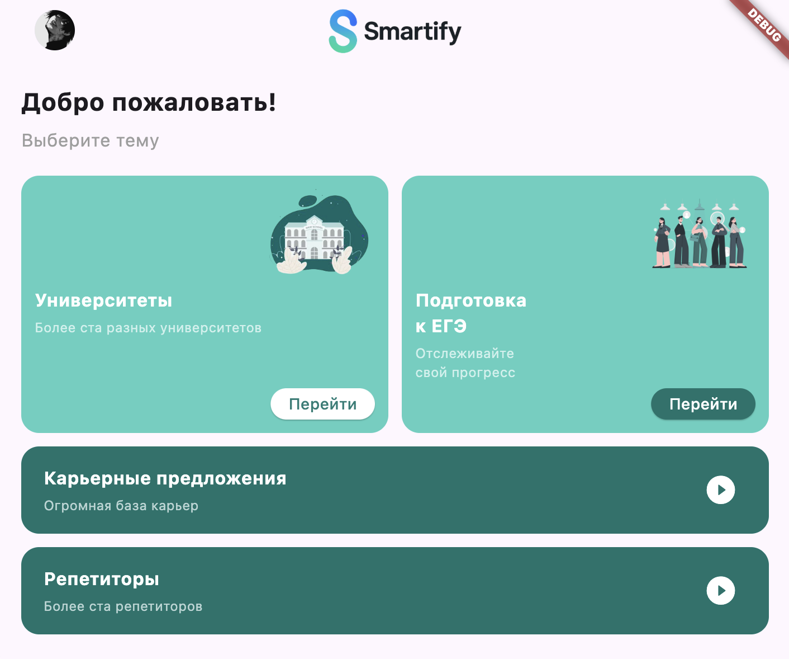
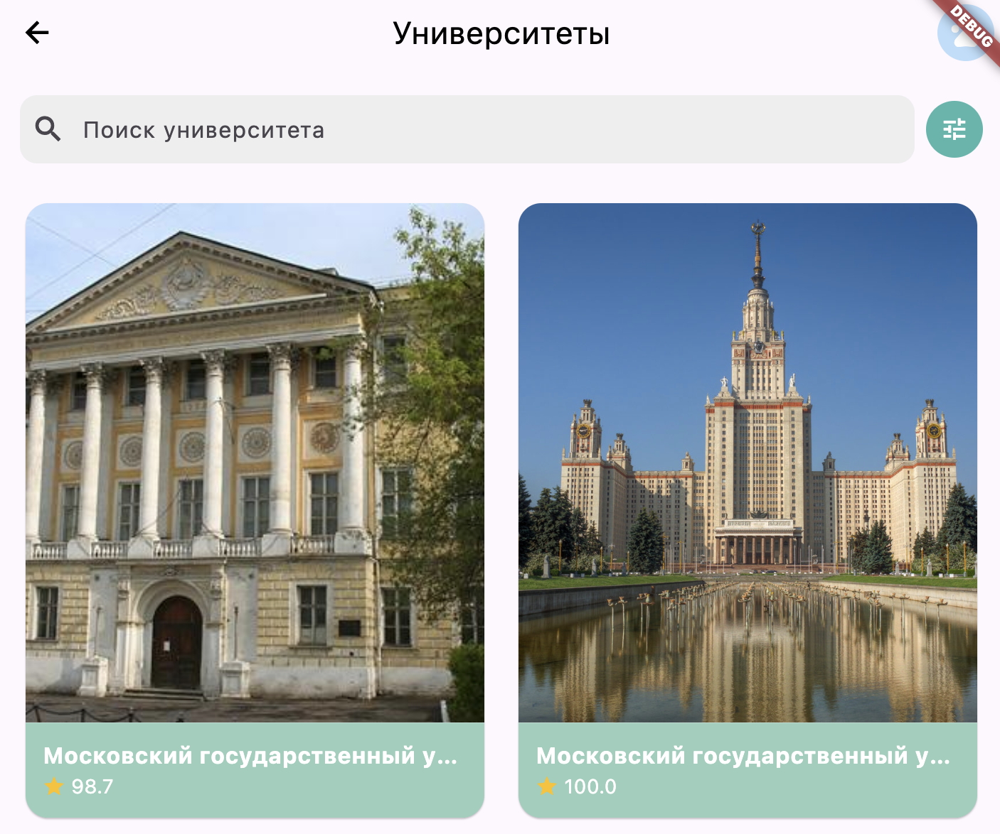
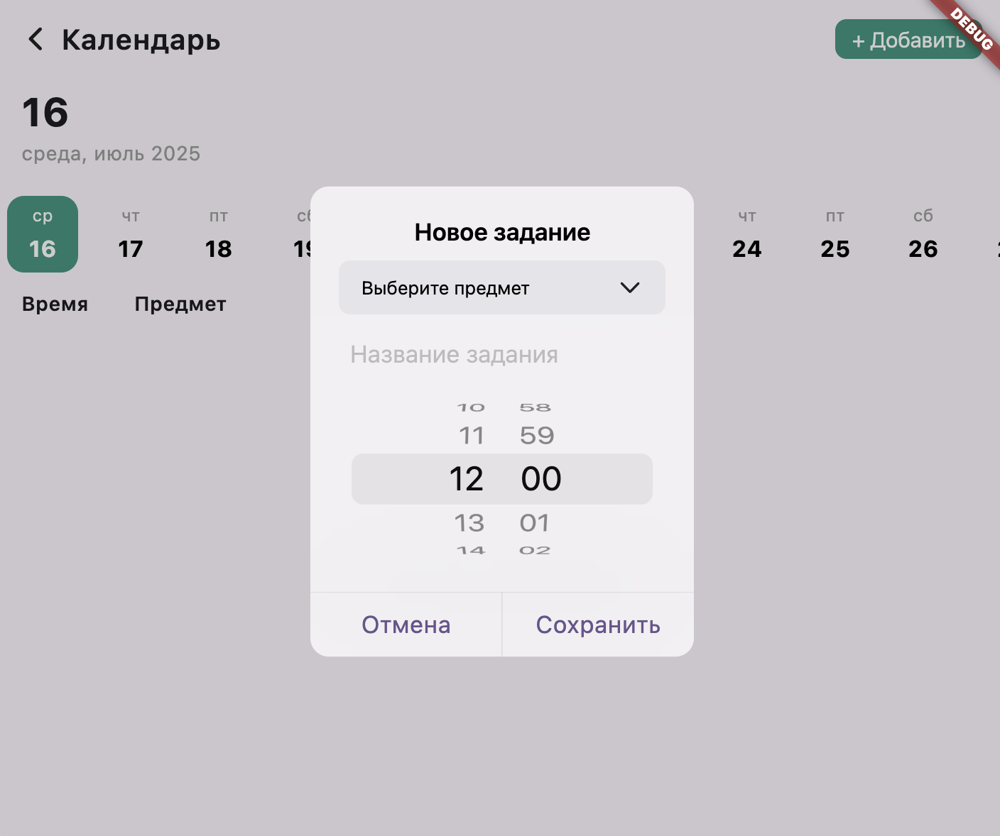
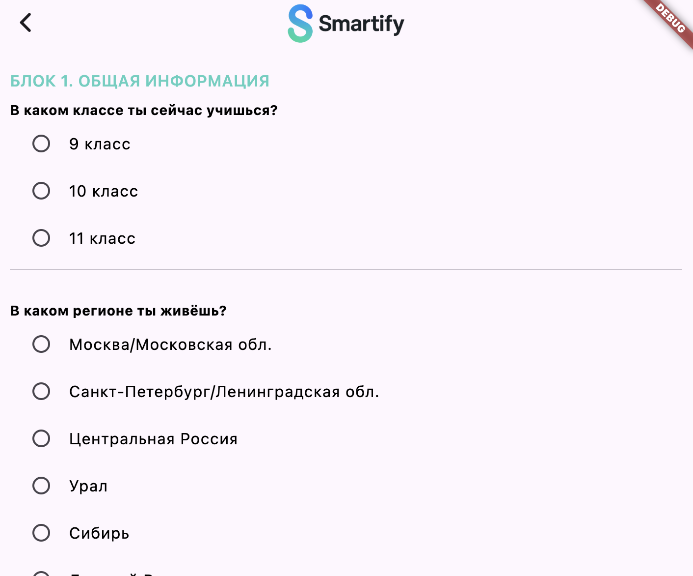
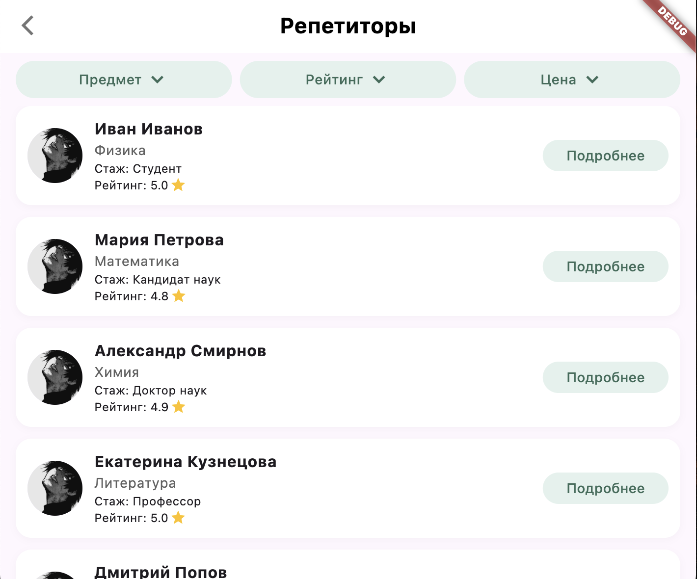
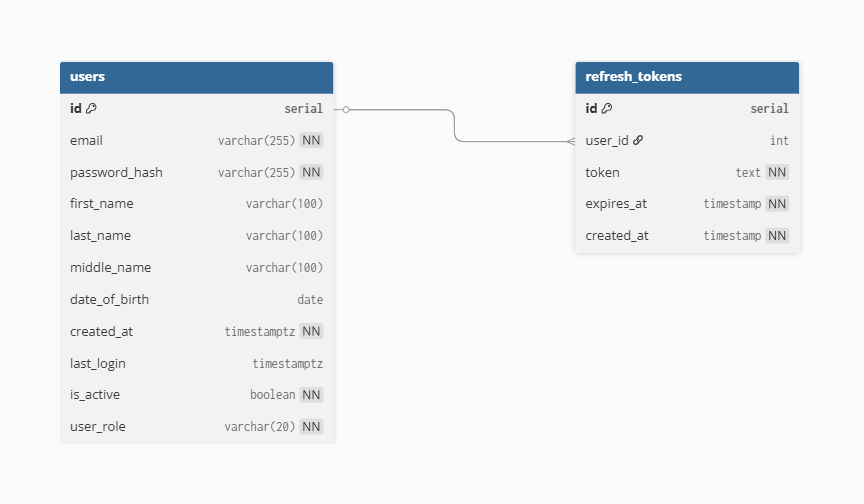
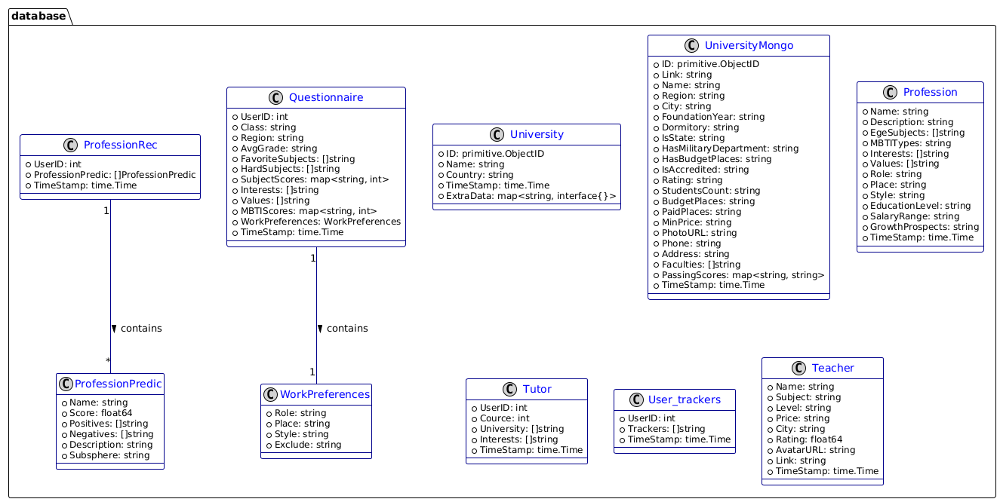

# Smartify Platform — Educational Platform for High School Students

**Smartify** is an all-in-one educational platform that helps Russian high school students (grades 9–11) navigate their career path, choose the right university, prepare for the Unified State Exam (ЕГЭ), and find suitable tutors.  
The key feature is **AI-based personalized recommendations** that make the journey clear and accessible for every student.

## 🔥 Key Advantages

- **All-in-one solution** — no need to juggle multiple websites and tools  
- **Personalized guidance** — specific career suggestions, not just general directions  
- **Accessible and clear** — recommendations based on student interests, scores, and goals  

---

## 🧩 Application Modules

### 1. 🔍 Career Guidance Module

- Interactive questionnaire covering interests, school performance, and hobbies  
- AI-powered analysis suggests **specific careers** (e.g., _pediatric surgeon_ instead of just _medic_)  
- Shows required subjects for admission right away  
- Includes reasoning behind the career choice to help students understand the fit

---

### 2. 🎓 University Selection Module

- Filter universities by region, tuition (budget/paid), and field of study  
- Compare universities by:
  - Entrance scores
  - Education costs
  - National rankings

---

### 3. 📚 Exam Preparation Module

- Based on the chosen career and university, recommends:
  - Required subjects
  - Weekly study plan (hours per subject)
- Built-in mini-tests to assess current knowledge  
- Progress tracker to monitor preparation

---

### 4. 👩‍🏫 Tutors Module

- Find tutors using flexible filters:
  - Subject
  - Teaching style (e.g., friendly, strict, structured)
- Browse detailed tutor profiles, including:
  - Background and experience
  - University they attended
  - etc.

---

## 🧠 Powered by AI

We use AI not just for buzz — but for real insights:
- Matching careers with individual traits
- Recommending optimal universities
- Dynamically adjusting preparation plans

---

## 🚀 Launching the app

Clone repository locally:
   ```sh
   git clone https://github.com/Smartify-Education-Platform/Smartify-Platform.git
   ```
Starting the app:
   ```sh
   cd Smartify-Platform/frontend
   flutter run
   ```

---

## 📸 Screenshots of the key features







---

## 📑 API Documentation

[Here](http://213.226.112.206:22025/swagger/index.html) is swagger documentation for our project

---

## 🔭 Architecture diagrams and explanations

## ER Diagram: users and refresh_tokens



This diagram represents the data model for a user authentication system, consisting of two tables: users and refresh_tokens.

### Entities

#### users
- Stores user account details.
- Key fields:
  - id: Unique user ID (Primary Key).
  - email: User's email address, unique and validated with a regex pattern.
  - password_hash: Hashed password.
  - first_name, last_name, middle_name: User’s name information.
  - date_of_birth: User’s date of birth, must be later than 1900-01-01.
  - created_at: Timestamp when the user was created.
  - last_login: Timestamp of the user’s last login.
  - is_active: Indicates whether the user account is active.
  - user_role: Role of the user (student, tutor, or administrator).

#### refresh_tokens
- Stores refresh tokens used for session management and re-authentication.
- Key fields:
  - id: Unique token record ID (Primary Key).
  - user_id: Foreign key referencing users.id.
  - token: The refresh token string.
  - expires_at: When the token expires.
  - created_at: When the token was created.

### Relationships
- users.id → refresh_tokens.user_id  
  One user can have multiple refresh tokens (one-to-many relationship).

---

## PlantUML Diagram: Database Domain Model



This UML diagram describes domain entities used in the system, representing a data model for educational and career recommendations.

### Entities

#### University
- Represents a university entity.
- Fields:
  - ID: Unique university identifier.
  - Name, Country: University details.
  - TimeStamp: Record creation/update time.
  - ExtraData: Additional data as a flexible key-value store.

#### UniversityMongo
- An extended university entity with additional fields for storing information from MongoDB.
- Fields include:
  - Link, Region, City
  - FoundationYear, Dormitory
  - Various flags like IsState, IsAccredited
  - Ratings, student counts, price information
  - Contact details like Phone and Address
  - Lists like Faculties and maps like PassingScores

#### Profession
- Describes a profession.
- Fields:
  - Name, Description
  - EgeSubjects, MBTITypes
  - Interests, Values
  - Role, Place, Style
  - EducationLevel, SalaryRange
  - GrowthProspects
  - TimeStamp

#### Questionnaire
- Captures user questionnaire data for career guidance.
- Fields:
  - UserID: Associated user.
  - School class, region, average grade
  - Lists of favorite and difficult subjects
  - SubjectScores: Map of subjects to scores
  - Interests, Values
  - MBTIScores: Map of MBTI results
  - Embedded object: WorkPreferences
  - TimeStamp

#### WorkPreferences
- Embedded within Questionnaire.
- Fields:
  - Role, Place, Style, Exclude

#### ProfessionRec
- Stores profession recommendations for users.
- Fields:
  - UserID
  - List of predicted professions: ProfessionPredic
  - TimeStamp

#### ProfessionPredic
- Represents an individual predicted profession.
- Fields:
  - Name, Score
  - Positive and negative aspects
  - Description
  - Subsphere

#### Tutor
- Captures data about tutors.
- Fields:
  - UserID
  - Cource (likely intended as “Course”)
  - List of universities
  - Interests
  - TimeStamp

#### User_trackers
- Stores tracking information for users.
- Fields:
  - UserID
  - Trackers: list of trackers
  - TimeStamp

#### Teacher
- Represents information about a teacher.
- Fields:
  - Name, Subject
  - Level, Price
  - City, Rating
  - AvatarURL, Link
  - TimeStamp

### Relationships

- Questionnaire → WorkPreferences  
  A Questionnaire contains exactly one WorkPreferences object.

- ProfessionRec → ProfessionPredic  
  A ProfessionRec contains multiple predicted professions.

---

  > Helping students make informed decisions — simply, clearly, and effectively.  
**Smartify: Your personalized guide to the future.**
